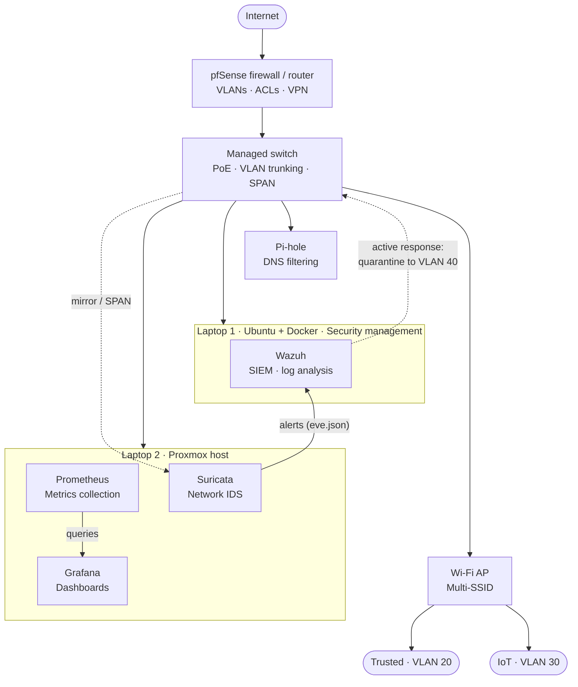

# Segmented Network & Intrusion Detection Lab

A home network rebuilt as a defended network: four security zones enforced
with VLANs and firewall policy, watched by a passive Suricata sensor,
correlated in Wazuh, with automated quarantine as the response path.
Every boundary documents the threat it mitigates, and every key detection
is proven against generated test traffic — not assumed.

> Companion repos: [`wazuh-siem-homelab`](../wazuh-siem-homelab) (SIEM core)
> · [`hardened-linux-image-pipeline`](../hardened-linux-image-pipeline)
> (host hardening for the endpoints on this network)

## Zone model & threat boundaries

| Zone | VLAN | Trust rationale | Boundary mitigates |
|---|---|---|---|
| Management | 10 | Admin interfaces only (pfSense, switch, Wazuh) | Credential theft pivoting to infrastructure control |
| Trusted | 20 | Patched, Wazuh-agented endpoints | Blast radius of a compromised user device |
| IoT | 30 | Unpatchable/low-trust devices | Lateral movement from compromised IoT firmware |
| Quarantine | 40 | Default-deny; no east-west, no egress | Contains devices flagged by detection pipeline |

Inter-zone policy is default-deny on pfSense; each allowed flow is a
documented exception in [`docs/segmentation-policy.md`](docs/segmentation-policy.md).

## Hardware

- MiniPC — pfSense firewall/router (VLANs, ACLs, VPN)
- Managed switch — VLAN trunking, PoE, SPAN mirror port
- Dell Laptop (Ubuntu + Docker) — Wazuh manager
- Dell Laptop (Proxmox) — Suricata sensor, Prometheus, Grafana
- Raspberry Pi 2 Model B — Pi-hole DNS filtering
- Wireless AP — multi-SSID, mapped to Trusted and IoT VLANs

## Architecture

Suricata runs as a **passive IDS** on a switch SPAN port — it sees
inter-zone traffic without sitting inline. This is a deliberate tradeoff:
passive deployment can't block in-line, but it can't drop legitimate
traffic on a false positive or become a network single point of failure.
Containment is instead handled downstream by Wazuh active response
(see below), keeping detection and enforcement decoupled.

## Detection → containment pipeline

1. **Detect:** Suricata inspects mirrored inter-zone traffic; detections
   log to `eve.json`
2. **Correlate:** a Wazuh agent ships `eve.json` to the Wazuh manager,
   where correlation rules classify severity and select a response
3. **Contain (active response):** for quarantine-worthy rules, an
   active-response script calls the managed switch's API (SNMP write or
   REST, depending on switch support) to reassign the offending device's
   access port to VLAN 40. Same cable, different policy — isolation
   without a physical change
4. **Notify (always):** independent of containment, Wazuh raises a
   dashboard alert and webhook/email notification so a human reviews
   every auto-quarantine event

**Why notification is non-negotiable:** an active response with no
accompanying alert can silently isolate a legitimate device on a false
positive, with no visibility until connectivity breaks. The notification
path is what keeps this a human-in-the-loop SOC workflow rather than
blind automation.

**Fallback enforcement point:** if the switch doesn't expose a usable
API for VLAN reassignment, the active response targets pfSense instead,
blocking the device by IP/MAC at the firewall. Same containment outcome,
different enforcement layer — documented in
[`docs/active-response.md`](docs/active-response.md).

## Validation — detections are proven, not assumed

Key rules are exercised with generated test traffic (e.g., nmap scans
from the IoT zone toward Management, EICAR-style transfer tests,
policy-violating egress attempts). Each test case in
[`docs/validation/`](docs/validation/) records: the traffic generated,
the Suricata rule expected to fire, the actual alert output, and —
for quarantine-class rules — evidence of the VLAN reassignment and the
human-review notification.

## Cloud mapping

The zone model here is deliberately the same design exercise as VPC
segmentation: VLANs ↔ subnets/security groups, SPAN + Suricata ↔ VPC
Flow Logs + GuardDuty, Wazuh active response ↔ EventBridge + Lambda
auto-remediation. The writeup maps each on-prem boundary to its AWS
equivalent so the two portfolios read as one defensive pattern applied
at two layers.

## Stack

pfSense · VLANs · Suricata · Wazuh · Proxmox · Prometheus · Grafana ·
Pi-hole · Docker

## Status & roadmap

- [x] VLAN segmentation and pfSense inter-zone policy
- [x] Suricata sensor on SPAN mirror, alerts shipping to Wazuh
- [ ] Active-response quarantine script (switch API path)
- [ ] Fallback pfSense block path
- [ ] Validation suite with captured evidence
- [ ] Segmentation policy + threat-boundary writeup
