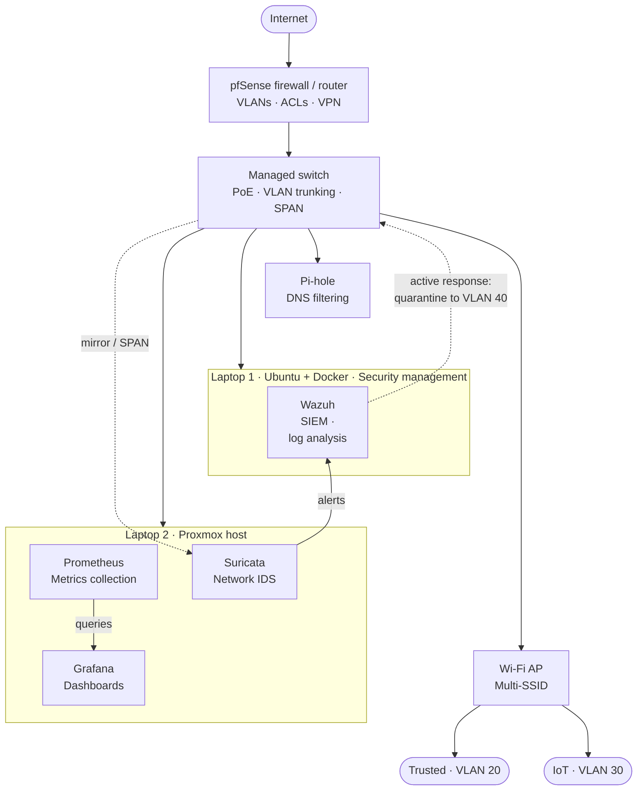

# network-segmentation-ids

A segmented home network. management, trusted, IoT, and quarantine zones enforced with VLANs and firewall policy. Instrumented with Suricata for network intrusion detection. Suricata alerts feed the Wazuh SIEM for correlation, mirroring the VPC segmentation and flow-log analysis in the cloud projects. The write-up documents the segmentation policy, the threat each boundary mitigates, and proof that key detections fire against generated test traffic.

## Physical Homelab Implementation

### Hardware

- Rapsberry Pi 2 Model B
- Dell Latitude - Running Surricata
- Dell Latitude - Running Wazuh
- MiniPC - Running PFSense
- Wireless Access Point
- Managed Switch

### Architecture

Suricata running inline on a segmented pfSense firewall with Wazuh ingesting alerts across VLANs

### Alerting & Automation

The Suricata sensor operates in passive IDS mode via a switch mirror port, detecting malicious traffic without sitting inline. Detections are logged to `eve.json` and shipped by a Wazuh agent to the Wazuh manager, where correlation rules classify severity and determine response.

**Active response - quarantine:**
When an alert matches a quarantine-worthy rule, Wazuh triggers an active-response script that calls the managed switch's API (SNMP write or REST, depending on switch support) to reassign the offending device's access port from its normal VLAN to VLAN 40 (quarantine). This isolates the device without requiring a physical port change; it's the same cable, just a different VLAN policy.

**Notification:**
Independent of the quarantine action, Wazuh raises a notification (dashboard alert, and/or email/webhook integration) so a human reviews every auto-quarantine event. This step is deliberate: an active response with no accompanying alert can silently isolate a legitimate device on a false positive, with no visibility until connectivity breaks. The notification path is what keeps this a human-in-the-loop SOC workflow rather than blind automation.

**Fallback path:**
If the switch doesn't expose a usable API for VLAN reassignment, the active response instead targets pfSense, blocking the device's IP/MAC via a firewall rule rather than moving it at the switch/VLAN level. Functionally similar containment, achieved at a different enforcement point.

**Design intent:**
This flow mirrors the detection-to-remediation pattern used in the cloud projects (VPC Flow Log analysis and automated findings triage), applied here at the network layer instead of the cloud layer: passive detection, correlation, automated containment, and an auditable alert trail.
