# network-segmentation-ids

A segmented home network. management, trusted, IoT, and quarantine zones enforced with VLANs and firewall policy. Instrumented with Suricata for network intrusion detection. Suricata alerts feed the Wazuh SIEM for correlation, mirroring the VPC segmentation and flow-log analysis in the cloud projects. The write-up documents the segmentation policy, the threat each boundary mitigates, and proof that key detections fire against generated test traffic.

### Hardware

Suricata running inline on a segmented pfSense firewall with Wazuh ingesting alerts across VLANs

```mermaid
graph TD
  ISP["ISP traffic in<br/>Fiber Jack"] --> PF["pfSense mini PC, 2 NICs<br/>WAN + LAN, VLAN routing + ACLs<br/>+ inline Suricata = IPS"]
  PF -->|"trunk, all VLANs tagged"| SW["Managed switch"]
  SW -->|"physical: mirror port"| SURICATA["Suricata sensor<br/>promiscuous NIC, passive = IDS"]
  SW --> WAZUH["Wazuh manager"]
  SW --> PIHOLE["Pi-hole"]
  SW --> AP["Wi-Fi access point<br/>trunk port, multi-SSID"]
  AP --> SSID1["SSID: IoT &#8594; VLAN 30"]
  AP --> SSID2["SSID: Trusted &#8594; VLAN 20"]
  SURICATA -.->|"log data over the network, not a cable"| WAZUH
  WAZUH -.->|"active response: reassign offending port's VLAN to 40"| SW
```

