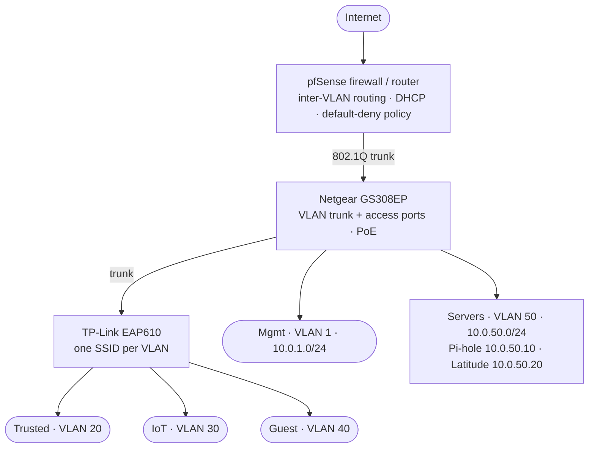

# Segmented Home Network (VLANs + pfSense)

> **Note:** The subnets and device IP addresses on this page are for demonstration
> only. They are not the ones I actually use. I keep the real addressing out of this
> repo for security reasons.

Segmenting my home network into five VLANs on a pfSense firewall, a managed
switch and a Wi-Fi access point, with default-deny firewall policy between them.
This is the flagship build of my [homelab](https://github.com/uploadtigris/my_home_lab)
and the hands-on half of my Network+ / CCNA study.

 **Build: October 2026**

Status means what it says: **running** is live today, **in progress** is being
built this month, **planned** is designed but not started.

> **First attempt, July 2026.** I created the VLANs on pfSense and the switch but
> the build stalled when no DHCP leases appeared on the tagged interfaces
> (write-up in [`notes/`](notes/)). That attempt used a `192.168.1.x` scheme and a
> different VLAN layout. I'm rebuilding it from a written plan with the cleaner
> `10.0.<VLAN>.0/24` addressing below — and the DHCP troubleshooting is part of the
> story, not something I'm hiding.

---

## Gear

| Device | Role |
|---|---|
| Sharevdi mini PC running pfSense | Router, firewall, DHCP, inter-VLAN routing |
| Netgear GS308EP (8-port PoE+ managed switch) | 802.1Q trunk + access ports, powers the AP |
| TP-Link EAP610 | Wi-Fi access point, one SSID per VLAN (only the Guest SSID is live today) |
| Raspberry Pi 2 Model B | Pi-hole DNS; moves into the Servers VLAN |
| TechMojo 10" rack | Holds it all |

---

## Zone model

Five VLANs, each on `10.0.<VLAN>.0/24`, so a device's VLAN is readable from its IP.

| VLAN | Name | Subnet | Who lives here | May reach |
|---|---|---|---|---|
| 1  | Mgmt    | 10.0.1.0/24  | Switch and AP management interfaces | Admin from Trusted only |
| 20 | Trusted | 10.0.20.0/24 | My laptop, phone and PCs | Internet + Servers on named ports |
| 30 | IoT     | 10.0.30.0/24 | Smart devices and the hydroponics project | DNS + internet only |
| 40 | Guest   | 10.0.40.0/24 | Visitors | Internet only (client isolation) |
| 50 | Servers | 10.0.50.0/24 | Pi-hole (10.0.50.10), Latitude server (10.0.50.20) | Reachable from Trusted on named ports |

Inter-VLAN traffic is **default-deny** on pfSense. Every allowed flow is a written
exception — for example, *"every VLAN may reach Pi-hole at 10.0.50.10 on port 53."*
Guests get internet only, IoT can reach nothing but DNS, and the Servers VLAN is
reachable from Trusted on named ports.

---

## Target design

pfSense routes between VLANs over a single 802.1Q trunk to the switch
(router-on-a-stick); the AP carries one SSID per VLAN on the same trunk.


```mermaid
graph TD
  NET([Internet]) --> PF["pfSense firewall / router<br/>inter-VLAN routing · DHCP · default-deny policy"]
  PF -- "802.1Q trunk" --> SW["Netgear GS308EP<br/>VLAN trunk + access ports · PoE"]
  SW -- "trunk" --> AP["TP-Link EAP610<br/>one SSID per VLAN"]
  SW --> V1(["Mgmt · VLAN 1 · 10.0.1.0/24"])
  SW --> SRV["Servers · VLAN 50 · 10.0.50.0/24<br/>Pi-hole 10.0.50.10 · Latitude 10.0.50.20"]
  AP --> V20(["Trusted · VLAN 20"])
  AP --> V30(["IoT · VLAN 30"])
  AP --> V40(["Guest · VLAN 40"])
```

---

## Status

- [ ] VLANs 1 / 20 / 30 / 40 / 50 on pfSense with per-VLAN DHCP
- [ ] Switch 802.1Q trunk and access ports (GS308EP)
- [ ] One SSID per VLAN on the EAP610
- [ ] Default-deny inter-VLAN rules with documented exceptions
- [ ] Rule tests from IoT and Guest (nmap evidence, recorded)
- [ ] Suricata sensor + Wazuh alerting (phase 2)

The full step-by-step checklist and working log for the build lives in
[`sysadmin_handbook/networking/Segmentation_Lab.md`](https://github.com/uploadtigris/sysadmin_handbook/blob/main/networking/Segmentation_Lab.md).

When the build is done and the rules are tested, this README gets the real zone
table, the switch port map, the firewall rule table (source, destination, port,
why), screenshots, and a **"Problems I hit"** section — starting with how I fixed
the July DHCP-lease failure.

---

## Phase 2 — detection (planned)


Once segmentation is built and tested, a Suricata sensor will watch inter-VLAN
traffic and forward alerts to Wazuh for correlation with host logs. Neither is
running yet — the SIEM itself is a separate rebuild
([`wazuh-siem-homelab`](https://github.com/uploadtigris/wazuh-siem-homelab)).

---

## Images

Diagrams and screenshots for this README go in [`images/`](images/). Real addresses,
SSID names and MAC addresses are redacted before anything is added.

To show one in this page:

```markdown

```

<!-- Add images below this line as they are captured -->

---

## Related

- [my_home_lab](https://github.com/uploadtigris/my_home_lab) — the gear and the wider roadmap
- [Segmentation lab build log](https://github.com/uploadtigris/sysadmin_handbook/blob/main/networking/Segmentation_Lab.md) — the step-by-step checklist, test matrix and STAR write-ups for this build
- [sysadmin_handbook](https://github.com/uploadtigris/sysadmin_handbook) — troubleshooting write-ups
- [wazuh-siem-homelab](https://github.com/uploadtigris/wazuh-siem-homelab) — the SIEM this feeds in phase 2

## Stack

pfSense · 802.1Q VLANs · inter-VLAN routing · DHCP · firewall policy · Wi-Fi (multi-SSID) · PoE · Pi-hole · nmap
