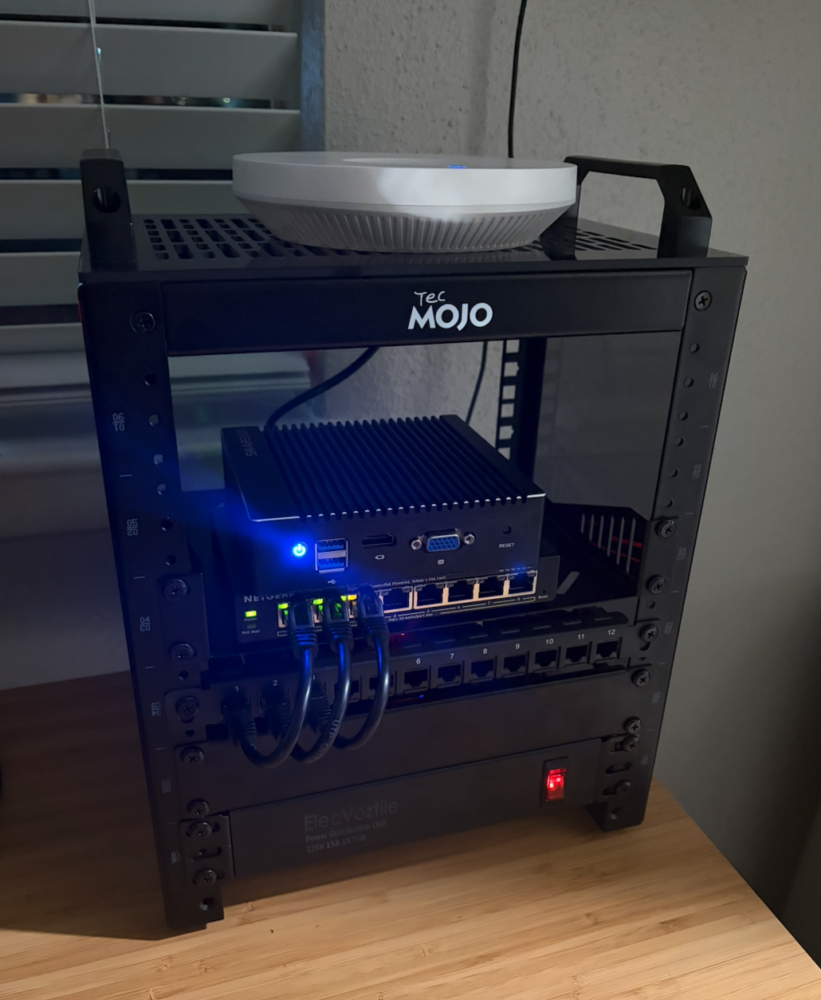
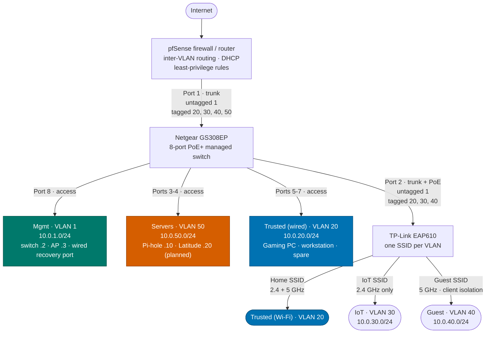
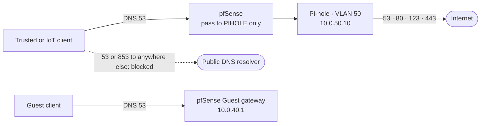

# Segmented Home Network (VLANs + pfSense)

I segmented my home network into five VLANs on a pfSense firewall, a managed switch and a Wi-Fi access point, with least-privilege firewall rules on every VLAN. It is the flagship build of my [homelab](https://github.com/uploadtigris/my_home_lab) and the hands-on half of my CCNA study.

**Why:** I want to host services and reach my network remotely without exposing everything on it, so each kind of device gets its own segment.  
**Status:**  The VLANs, firewall rules and Pi-hole DNS are built, and the 10-test validation matrix passed on 2026-10-09 ([step 7](docs/build-log.md#step-7)). Step 6 (hydroponics to IoT) is deferred, and the [roadmap](#roadmap) lists what's left.  
**Skills:** 802.1Q and inter-VLAN routing, firewall policy, DHCP and DNS, TLS and PKI for admin pages, written risk decisions.

> [!IMPORTANT]
> The subnets and device IP addresses on this page are for demonstration only. They are not the ones I actually use. I keep the real addressing out of this repo for security reasons.

---

## What this demonstrates

- **Segmentation design (802.1Q, router-on-a-stick):** the [zone model](#zone-model) and [final design](#final-design), built in [steps 1 and 2](docs/build-log.md#step-1), with the [trunk test](docs/build-log.md#step-2-trunk-test).
- **Least-privilege firewall rules on every VLAN, including Trusted:** the [rule table](#firewall-rules) and [step 5](docs/build-log.md#step-5). I got the rule order wrong once before applying ([Problem 9](docs/build-log.md#problem-9)).
- **DNS filtering and bypass prevention:** Pi-hole on the Servers VLAN ([step 4](docs/build-log.md#step-4)), with Trusted and IoT forced through it. A block rule on ports 53 and 853 stops bypass, instead of the NAT redirect I first planned: a block is explicit and shows up in tests, while a redirect hides devices that misbehave.
- **PKI and TLS for admin pages:** an internal CA, correct SANs and trust stores ([build log 0.5](docs/build-log.md#step-0-5)).
- **Risk assessment with compensating controls:** the [AP certificate decision](docs/build-log.md#problem-5) and the [risk register](#risk-register).
- **Test evidence:** the 10-test validation matrix, all passed on 2026-10-09 ([step 7](docs/build-log.md#step-7)).
- **Troubleshooting written up:** [13 problem entries](docs/build-log.md#problem-1), from stale DHCP leases to DNS rebind protection and a Moonlight re-pairing.
- **Change safety:** encrypted config backups taken before changes, and a wired recovery port on Mgmt ([step 0](docs/build-log.md#step-0)).

---

## Gear

  

| Device | Role |
|---|---|
| Sharevdi mini PC running pfSense | Router, firewall, DHCP, inter-VLAN routing |
| Netgear GS308EP (8-port PoE+ managed switch) | 802.1Q trunk and access ports, powers the AP |
| TP-Link EAP610 | One SSID per VLAN (table below). The original flat SSIDs are retired |
| Raspberry Pi 2 Model B | Pi-hole DNS, on the Servers VLAN |
| TechMojo 10" rack | Holds it all |

| SSID | VLAN | Band | Security |
|---|---|---|---|
| Home | 20 | 2.4 + 5 GHz | WPA2/WPA3-Personal (transition mode) |
| IoT | 30 | 2.4 GHz only | WPA2-Personal (the devices don't support WPA3 or 5 GHz) |
| Guest | 40 | 5 GHz | WPA2/WPA3-Personal, client isolation on |

---

## Zone model

Five VLANs, each on `10.0.<VLAN>.0/24`, so a device's VLAN is readable from its IP.

| VLAN | Name | Subnet | Who lives here | May reach |
|---|---|---|---|---|
| 1 | Mgmt | 10.0.1.0/24 | Switch, AP and firewall admin pages; wired recovery port (switch port 8); the Latitude for now | Everything. Admin pages are reachable only from the **wired Mgmt port**: Trusted Wi-Fi can't reach them, by design |
| 20 | Trusted | 10.0.20.0/24 | My laptop, phone and PCs | DNS to Pi-hole and the internet. Blocked from the firewall and all internal networks. Same-VLAN traffic such as Moonlight and Wake-on-LAN works |
| 30 | IoT | 10.0.30.0/24 | Smart devices, the hydroponics project (deferred) | DNS to Pi-hole and the internet only |
| 40 | Guest | 10.0.40.0/24 | Visitors and work laptops | DNS from its own gateway and the internet only. Never touches Pi-hole |
| 50 | Servers | 10.0.50.0/24 | Pi-hole (.10); the Latitude (.20, planned) | Pi-hole reaches the internet on 53, 80, 123 and 443 only. Servers can't start connections into other VLANs; DNS replies still flow because the firewall is stateful |

The Latitude stays on Mgmt until NextCloud is set up, then moves to Servers (switch port 4).

  

### Firewall rules

Rules are evaluated top-down and the first match wins. Each VLAN follows one pattern: allow what it needs, block the firewall, block internal networks, then allow the internet. Aliases: `PRIVATE_NETS` (all RFC 1918 ranges), `PIHOLE` (the Pi-hole host), `DNS_PORTS` (53, 853), `PIHOLE_OUT` (53, 80, 123, 443). Detail and tests are in [step 5](docs/build-log.md#step-5).

| Interface | Action | Source | Destination | Port | Why |
|---|---|---|---|---|---|
| Trusted, IoT | Pass | the VLAN | `PIHOLE` | 53 | DNS goes through Pi-hole |
| Trusted, IoT | Block | the VLAN | any | `DNS_PORTS` | No bypass with hardcoded resolvers or DNS-over-TLS |
| Trusted, IoT | Block | the VLAN | This Firewall | any | Admin pages only from the wired Mgmt port |
| Trusted, IoT | Block | the VLAN | `PRIVATE_NETS` | any | No other internal network |
| Trusted, IoT | Pass | the VLAN | any | any | The internet |
| Guest | Pass | Guest | Guest gateway | 53 | DNS from pfSense, so guests never touch an internal server |
| Guest | Block | Guest | This Firewall | any | Admin pages only from the wired Mgmt port |
| Guest | Block | Guest | `PRIVATE_NETS` | any | Guests reach no internal network |
| Guest | Pass | Guest | any | any | The internet |
| Servers | Block | Servers | This Firewall | any | Admin pages only from the wired Mgmt port |
| Servers | Block | Servers | `PRIVATE_NETS` | any | Servers can't start connections into other VLANs |
| Servers | Pass | `PIHOLE` | any | `PIHOLE_OUT` | The Pi-hole host reaches the internet for updates and blocklists |
| Mgmt (LAN) | Pass | Mgmt | any | any | Admin from the wired Mgmt port |

### Management access

Admin pages use HTTPS with certificates from a private CA (`homelab-ca`) on pfSense. The switch only offers HTTP, and the EAP610 only serves a vendor default certificate I chose not to trust ([Problem 5](docs/build-log.md#problem-5)), so both are protected by making Mgmt reachable only from the wired port. Admin pages have `home.arpa` names (RFC 8375) from Pi-hole's local DNS; pfSense's DNS rebind protection needed the hostname added under Alternate Hostnames ([Problem 11](docs/build-log.md#problem-11)).

| Device | Web UI | Certificate | Status |
|---|---|---|---|
| pfSense, Pi-hole | HTTPS | `homelab-ca` | ✅ Done |
| GS308EP switch | HTTP only | Not possible | ✅ Mitigated: wired Mgmt only |
| EAP610 AP | HTTPS (vendor default) | Not trusted by design | ✅ Mitigated: wired Mgmt only |
| Latitude (NextCloud) | n/a yet | Planned | Deferred |

---

## Final design

pfSense routes between VLANs over one 802.1Q trunk to the switch (router-on-a-stick). A second trunk feeds the AP, which carries one SSID per VLAN.

```mermaid
graph TD
  NET([Internet]) --> PF["pfSense firewall / router<br/>inter-VLAN routing · DHCP<br/>least-privilege rules"]
  PF -- "Port 1 · trunk<br/>untagged 1<br/>tagged 20, 30, 40, 50" --> SW["Netgear GS308EP<br/>8-port PoE+ managed switch"]
  SW -- "Port 8 · access" --> MG["Mgmt · VLAN 1<br/>10.0.1.0/24<br/>switch .2 · AP .3 · wired recovery port"]
  SW -- "Ports 3-4 · access" --> SRV["Servers · VLAN 50<br/>10.0.50.0/24<br/>Pi-hole .10 · Latitude .20 (planned)"]
  SW -- "Ports 5-7 · access" --> TW["Trusted (wired) · VLAN 20<br/>10.0.20.0/24<br/>Gaming PC · workstation · spare"]
  SW -- "Port 2 · trunk + PoE<br/>untagged 1<br/>tagged 20, 30, 40" --> AP["TP-Link EAP610<br/>one SSID per VLAN"]
  AP -- "Home SSID<br/>2.4 + 5 GHz" --> V20(["Trusted (Wi-Fi) · VLAN 20"])
  AP -- "IoT SSID<br/>2.4 GHz only" --> V30(["IoT · VLAN 30<br/>10.0.30.0/24"])
  AP -- "Guest SSID<br/>5 GHz · client isolation" --> V40(["Guest · VLAN 40<br/>10.0.40.0/24"])

  classDef servers fill:#D55E00,stroke:#8a3d00,color:#ffffff
  classDef trusted fill:#0072B2,stroke:#004a75,color:#ffffff
  classDef mgmt fill:#00796B,stroke:#004d44,color:#ffffff
  class SRV servers
  class TW,V20 trusted
  class MG mgmt
```

**DNS flow.** Trusted and IoT clients can only ask Pi-hole. Guest clients ask their own gateway.

```mermaid
graph LR
  C["Trusted or IoT client"] -- "DNS 53" --> PF["pfSense<br/>pass to PIHOLE only"]
  PF --> PH["Pi-hole · VLAN 50<br/>10.0.50.10"]
  PH -- "53 · 80 · 123 · 443" --> NET([Internet])
  C -. "53 or 853 to anywhere else: blocked" .-> X(["Public DNS resolver"])
  G["Guest client"] -- "DNS 53" --> GW["pfSense Guest gateway<br/>10.0.40.1"]
```

---

## Security decisions

- **VLAN ID matches the third octet.** A device's VLAN reads from its IP. Trade-off: renumbering means re-addressing.
- **Mgmt on the existing untagged LAN (VLAN 1), admin from the wired port only.** I kept my LAN as Mgmt, and believe Netgear Plus switches only serve their UI on VLAN 1 (not independently confirmed). Trade-off: no admin from Trusted Wi-Fi, so I use a cable.
- **Separate Servers VLAN.** Pi-hole and the Latitude (planned) sit apart, and IoT can't reach them. Trade-off: more rules to write and test.
- **Guest DNS from its own gateway, never Pi-hole.** Guests get no path into Servers, even for DNS. Trade-off: no Pi-hole filtering for guests.
- **Block DNS bypass (ports 53 and 853) instead of a NAT redirect.** A block is explicit and shows up in tests, while a redirect hides misbehaving devices. Trade-off: a hardcoded resolver breaks instead of being silently fixed.
- **Work laptops on Guest.** Employer-managed devices are untrusted at home. Trade-off: they can't reach my devices.
- **Moonlight handheld on the gaming PC's VLAN.** No cross-VLAN exception is needed. Trade-off: it shares Trusted with my main devices.
- **Internal CA for admin pages.** A certificate warning now means something. Trade-off: I run a CA, its key stays on pfSense, and certificates expire.
- **Switch and AP admin only from wired Mgmt.** The switch has no HTTPS, and the AP serves a vendor certificate I won't trust (likely shared across devices, not verified). Trade-off: switch credentials aren't encrypted on the wire, so wired-only access and a strong password carry the risk.
- **Keep firmware current.** I updated the AP from 1.5.0 to 1.8.0. pfSense and the switch are still to check, and backups come first.

---

## Risk register

Likelihood is my own estimate.

- **Switch admin UI (HTTP only):** credentials could be sniffed. Low. Wired Mgmt only ([step 5](docs/build-log.md#step-5)) and a strong password. **Mitigated.**
- **AP admin page (vendor certificate, likely shared):** someone on Mgmt could impersonate it. Low. Certificate not trusted, weak protocols off, wired Mgmt only. **Mitigated.**
- **Internal CA key:** if stolen, someone could issue certificates my devices trust. Low. The key stays on pfSense, and exported keys are deleted. **In place.**
- **DNS bypass from Trusted and IoT:** a device could skip Pi-hole with its own resolver. Low (was Medium). Block 53 and 853 to anything except Pi-hole, tested in [step 7](docs/build-log.md#step-7) (test 3). **Mitigated.**
- **Lockout during the build:** a bad VLAN or trunk change can cut me off (it happened in my first attempt). Medium. Recovery port 8 and backups first ([step 0](docs/build-log.md#step-0)). **Mitigated.**
- **pfSense 2.8.1:** behind the current release (2.9.0), and an upgrade could break rules. Low. Encrypted config backup and a boot environment first, in a maintenance window. **Pending.**

---

## Roadmap

- Upgrade pfSense 2.8.1 to 2.9.0, and check the GS308EP firmware.
- NextCloud on the Latitude, moved to Servers (port 4), with its certificate and the server tests.
- Hydroponics onboarding to IoT ([step 6](docs/build-log.md#step-6)).
- Detection: pfSense syslog into Wazuh ([`wazuh-siem-homelab`](https://github.com/uploadtigris/wazuh-siem-homelab)), then Suricata.

## Related

[my_home_lab](https://github.com/uploadtigris/my_home_lab) (the gear and wider roadmap) · [wazuh-siem-homelab](https://github.com/uploadtigris/wazuh-siem-homelab) (the SIEM this feeds)

**Stack:** pfSense · 802.1Q VLANs · inter-VLAN routing · DHCP · firewall policy · Wi-Fi (multi-SSID) · PoE · Pi-hole · internal CA / TLS · openssl

---

**Talking points:** how a Trusted device's DNS query reaches Pi-hole through the trunk and pfSense, and why a lookup against a public resolver is blocked · why rule order matters ([Problem 9](docs/build-log.md#problem-9)) · why admin is reachable only from wired Mgmt · what broke and how I found it (the stale DHCP lease in [Problem 12](docs/build-log.md#problem-12), and the Moonlight re-pairing after re-addressing in [Problem 13](docs/build-log.md#problem-13)) · why I won't trust the AP's vendor certificate.
