# Segmentation Lab: Build Log

> [!IMPORTANT]
> The subnets and device IP addresses on this page are for demonstration only. They
> are not the ones I actually use. I keep the real addressing out of this repo for
> security reasons.

**Date:** 2026-10-07 to 2026-10-09  
**OS:** pfSense, Netgear GS308EP firmware, TP-Link EAP610 firmware, Linux Debian Trixie  
**Environment:** Homelab  
**Category:** Networking, VLANs, Firewall, DHCP, DNS  
**Status:** Completed (phase 1). Step 6 (hydroponics to IoT) is deferred

The design, security decisions and risk register are in the [README](../README.md). This page is the working log: what I did, in order, and what broke along the way.

---

## Situation

- **Network before the build:** I had bought all the components (managed switch, router, mini rack, access point) but found there was more planning in the VLANs and firewall rules than I expected. I tried to set the VLANs up quickly, lost access to the devices, and had to factory-reset them. I let some time pass and planned the network more formally. In the meantime every port on the switch could reach every resource on the network, which is not my idea of secure.
- **What prompted the build:** I want to host websites and reach my network from anywhere over a VPN, for example to stream games from my gaming PC, reach files in a personal cloud, or send Wake-on-LAN requests. To do that securely, I needed to segment the network first.

## Task

Segment the home network into five VLANs with default-deny rules between them, and prove each rule works from the restricted side. Done when the validation matrix in step 7 passes, or each failure is documented.

| VLAN | Name | Subnet | Gateway | Who lives here |
|---|---|---|---|---|
| 1 | Mgmt | 10.0.1.0/24 | 10.0.1.1 | Switch (10.0.1.2), AP (10.0.1.3), recovery port |
| 20 | Trusted | 10.0.20.0/24 | 10.0.20.1 | Laptop, phone, PCs |
| 30 | IoT | 10.0.30.0/24 | 10.0.30.1 | Smart devices, hydroponics project |
| 40 | Guest | 10.0.40.0/24 | 10.0.40.1 | Visitors |
| 50 | Servers | 10.0.50.0/24 | 10.0.50.1 | Pi-hole (10.0.50.10), Latitude 7490 (10.0.50.20, planned), Wazuh server on a Latitude 5420 (10.0.50.30, planned) |

## Action

<a id="step-0"></a>

### 0. Before touching anything — Date: 2026-10-08

- ✅ Config backups of pfSense (encrypted), the switch and the AP, plus a second switch backup after the VLAN changes. All are stored outside the repo
- ✅ Current IPs of pfSense, the switch, the AP and the Pi-hole written down privately, not published
- ✅ Laptop wired to switch port 8, the Mgmt recovery port, for the whole build

<a id="step-0-4"></a>

### 0.4 Management access: patch panel — Date: 2026-10-08

I plugged the devices into the patch panel for secure management. The left photo numbers the parts of the rack; the right one shows the cabling after I plugged everything in.

<table>
  <tr>
    <td align="center" valign="top">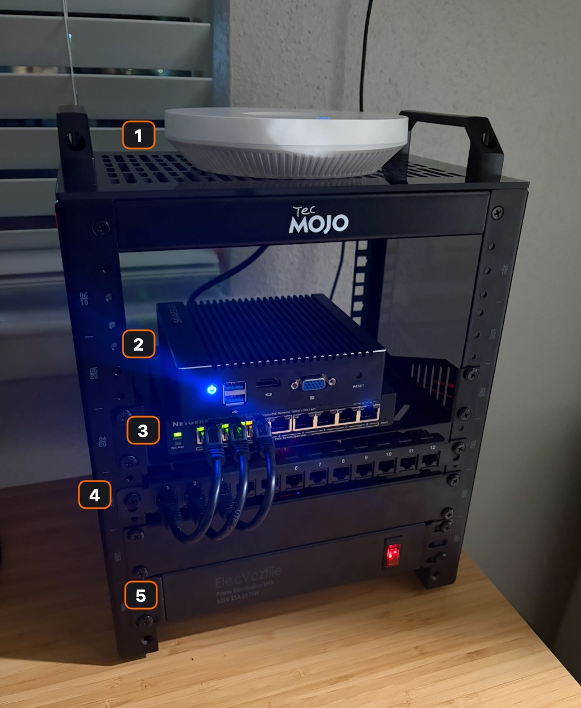</td>
    <td align="center" valign="top">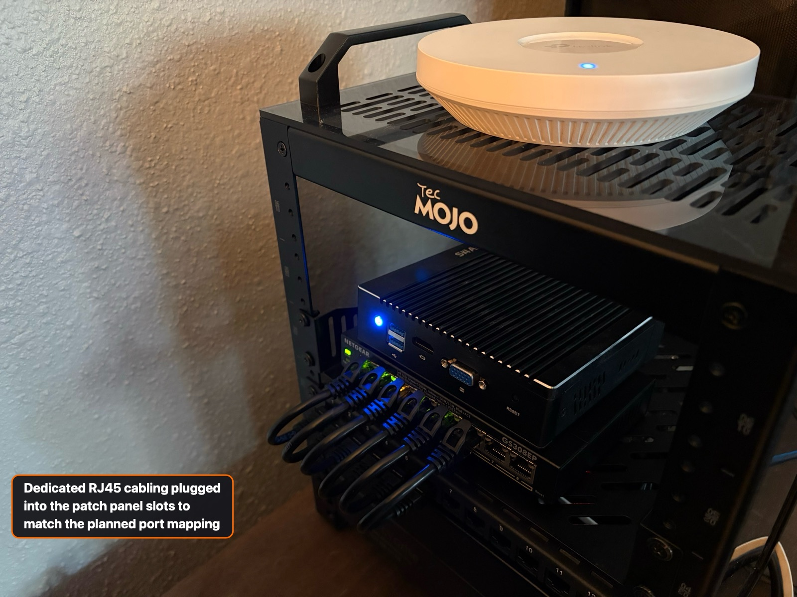</td>
  </tr>
</table>

Left photo: **1** TP-Link EAP610 access point, **2** pfSense mini PC, **3** Netgear GS308EP switch, **4** patch panel, **5** power strip.

<a id="step-0-5"></a>

### 0.5 Management access: trusted HTTPS with an internal CA — Date: 2026-10-08

Why: so I'm not trained to click through certificate warnings on my own admin pages, and so a spoofed admin page would stand out.

| Device | Web UI | Certificate | Status |
|---|---|---|---|
| pfSense | HTTPS | `pfsense-gui`, signed by `homelab-ca` | ✅ Done |
| Pi-hole | HTTPS (v6) | `pihole-gui`, signed by `homelab-ca` | ✅ Done |
| GS308EP switch | HTTP only | Not possible: no HTTPS | ✅ Mitigated: reachable only from wired Mgmt (step 5) |
| EAP610 AP | HTTPS (vendor default) | Not trusted by design ([Problem 5](#problem-5)) | ✅ Mitigated: reachable only from wired Mgmt (step 5) |
| Latitude 7490 (NextCloud) | n/a yet | **Deferred** until NextCloud is set up | |

- The CA is `homelab-ca` in pfSense (the certificate's CN is `internal-ca`), and its private key never leaves pfSense.
- `pfsense-gui`: RSA 2048, SHA256, 398 days (well inside Apple's 825-day limit for private CAs), with SANs for `pfsense.home.arpa` and the Mgmt IP, set under System > Advanced > Admin Access.
- `pihole-gui`: issued the same way, then combined with its key into one PEM, copied to the Pi and set with `pihole-FTL` ([Problem 4](#problem-4)). The exported key was deleted from my laptop afterwards.
- I trusted the CA in the Mac's System keychain ([Problem 2](#problem-2)), and both admin pages now load with no certificate warning.
- The EAP610 can't load a custom certificate. I compensated by turning off everything I could on its Web Server page (see screenshot 4 and [Problem 5](#problem-5)).

Evidence for the two claims that matter most:

```
curl -sk -o /dev/null -w "%{http_code}\n" https://10.0.1.2   # 000: the switch serves no HTTPS
curl -s  -o /dev/null -w "%{http_code}\n" http://10.0.1.2    # 200: HTTP only
openssl ... -subject -dates   # AP: subject=CN=omadaeap.net, notBefore=Jan 1 2019, notAfter=Dec 31 2039
```

**Screenshots** (annotated; the numbers match the callouts, and I covered the address bar in every browser screenshot)

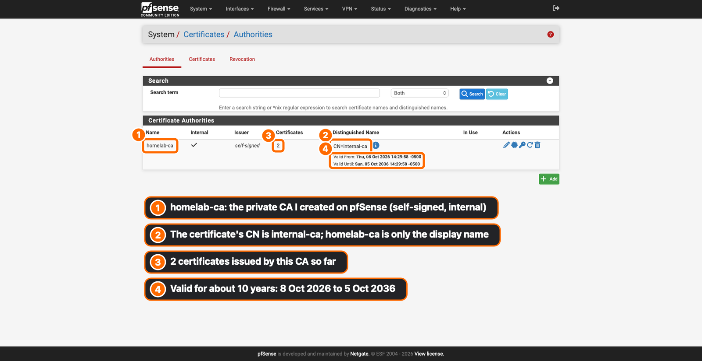

_1. System > Certificates > Authorities: the private CA on pfSense, valid about 10 years, with two certificates issued._

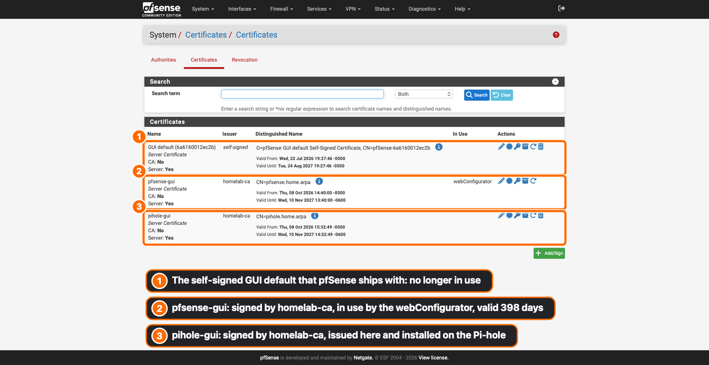

_2. System > Certificates: the self-signed GUI default is no longer in use. `pfsense-gui` and `pihole-gui` are signed by `homelab-ca` and valid for 398 days._

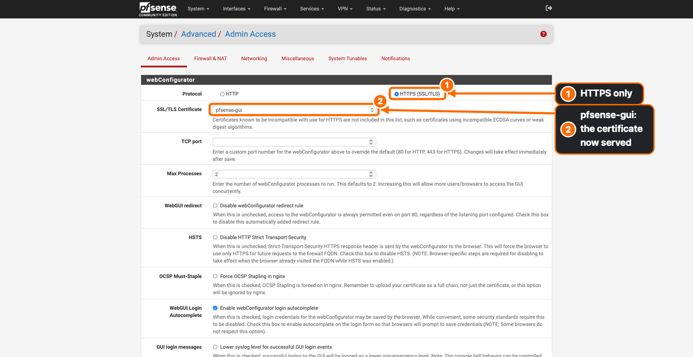

_3. System > Advanced > Admin Access: HTTPS, with the certificate set to `pfsense-gui`. Creating a certificate doesn't deploy it, so this setting is the step that matters ([Problem 3](#problem-3))._

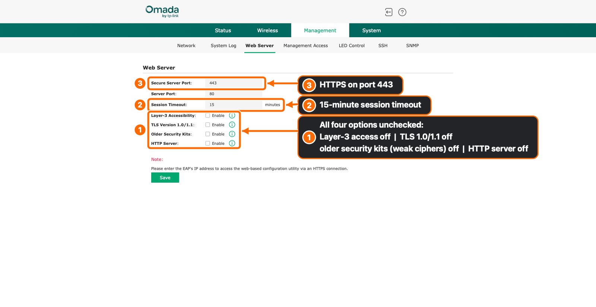

_4. The AP's compensating controls: HTTPS on 443, a 15-minute timeout, and Layer-3 access, TLS 1.0/1.1, weak ciphers and the HTTP server all off._

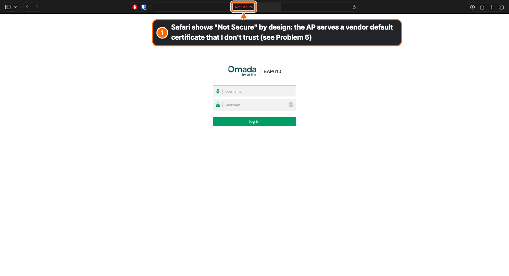

_5. The one admin page that still says "Not Secure", by design: the AP serves a vendor default certificate I chose not to trust. The pfSense and Pi-hole pages load with no warning._

<a id="step-1"></a>

### 1. pfSense: VLANs and DHCP — Date: 2026-10-08

_Decision: LAN is kept as Mgmt rather than re-addressed. In the demo scheme it is still shown as 10.0.1.1._

- ✅ VLANs 20, 30, 40 and 50 on the LAN NIC (igc2), each added as an interface named TRUSTED / IOT / GUEST / SERVERS, with a static 10.0.X.1/24 and the upstream gateway left as None so pfSense doesn't treat them as WANs
- ✅ DHCP on each VLAN, range .100 to .199. DNS is 10.0.50.10 (Pi-hole) on Trusted, IoT and Servers, and 10.0.40.1 (pfSense) on Guest, so guests never need to reach an internal server
- ✅ Reservations for the NAS and the AP, and a static address on the switch. The Pi-hole's address is set on the host itself (step 4)
- **Deferred:** the Latitude 7490's Servers address (10.0.50.20) is set when it moves to Servers (see step 2, port 4)

```
pfSense CE 2.8.1 uses the Kea DHCP backend. The general DHCP settings (DNS registration, high
availability) are off on purpose. New VLAN interfaces have no firewall rules, so pfSense blocks all
of their traffic until step 5 (it still answers DHCP). That is the secure default.
```

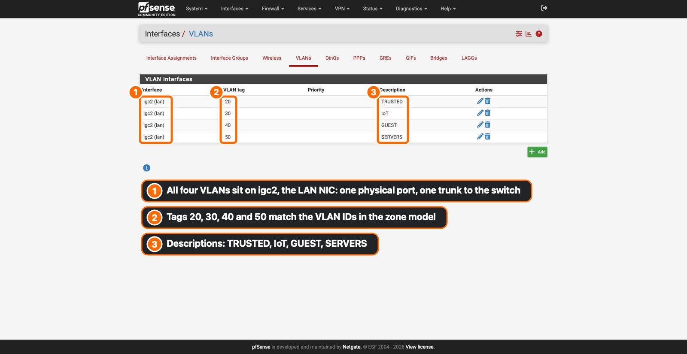

_Interfaces > VLANs: tags 20, 30, 40 and 50 on the LAN NIC._

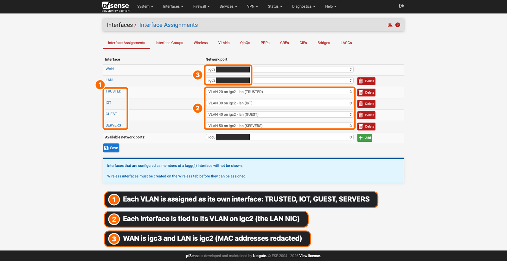

_Interfaces > Interface Assignments: each VLAN is its own interface. MAC addresses are redacted. I did not screenshot the DHCP scope pages because they show real addresses; the per-VLAN leases are in step 3._

<a id="step-2"></a>

### 2. Switch: 802.1Q VLANs (GS308EP) — Date: 2026-10-08

_Decision: ports 3 to 6 kept VLAN 1 until their steps. Moving the Pi-hole (port 3) before step 4 would break DNS for the whole network, and moving the PCs (ports 5 and 6) before step 5 would leave them with no internet. I configured the trunk (port 1) and the AP (port 2) first, and used spare port 7 on VLAN 20 to prove the trunk works._

<p align="center">
  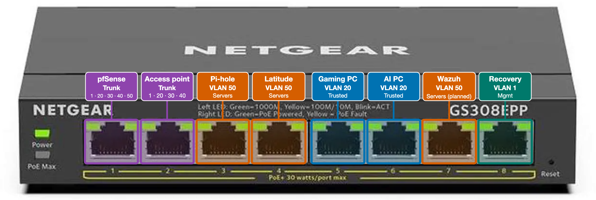
</p>

| Port | Device | Untagged (PVID) | Tagged |
|---|---|---|---|
| 1 | pfSense LAN (trunk) | 1 | 20, 30, 40, 50 |
| 2 | EAP610 (PoE) | 1 | 20, 30, 40 |
| 3 | Pi-hole | 50 | none |
| 4 | Latitude 7490 | 50 | none |
| 5 | Gaming PC | 20 | none |
| 6 | Workstation | 20 | none |
| 7 | Spare (Trusted). Planned: Wazuh server (Latitude 5420) | 20 now, 50 planned | none |
| 8 | Recovery port (Mgmt) | 1 | none |

- ✅ Advanced 802.1Q enabled, VLANs 20, 30, 40, 50 created and named, and every port labeled to match the map (labels are cosmetic)
- ✅ Port 1 tagged on 20, 30, 40, 50. Port 2 tagged on 20, 30, 40. Ports 1, 2 and 8 stay untagged in VLAN 1
- ✅ Port 7: untagged on VLAN 20, PVID 20, removed from VLAN 1. Port 3 moved in step 4, and ports 5 and 6 in step 5
- ✅ Switch given a static address (10.0.1.2), and its UI confirmed reachable from port 8, the way back in
- **Deferred:** port 4 (Latitude 7490): PVID 50, VLAN 50, removed from VLAN 1. It moves when NextCloud is set up
- **Deferred:** port 7 (Latitude 5420, the Wazuh server): PVID 50, VLAN 50, removed from VLAN 1. It is the Trusted spare until the Wazuh rebuild, and the Servers rules need one more pass rule for it first (see the [Wazuh build log](https://github.com/uploadtigris/wazuh-siem-homelab/blob/main/docs/build-log.md))

```
On this switch's new UI, marking a port U in a VLAN automatically set its PVID, but the port stayed a
member of VLAN 1 until I set it to E by hand. If that step is missed, Mgmt broadcasts leak out of an
access port. U controls traffic leaving the port and the PVID controls untagged traffic arriving, so if
they don't match, traffic is one-way, a classic cause of no DHCP lease.
```

<a id="step-2-trunk-test"></a>

**Trunk test.** I moved the laptop to port 7 and turned Wi-Fi off, so the test used only the wired path. It first kept its old Mgmt lease ([Problem 6](#problem-6)). After a forced renew it got 10.0.20.100 from the Trusted scope (I checked it on the pfSense leases page, which shows addresses, so I didn't screenshot it). That proves VLAN 20 is tagged end to end from the switch to pfSense, the path that failed in my first attempt ([Problem 1](#problem-1)).

```
sudo ipconfig set <wired-interface> DHCP
```

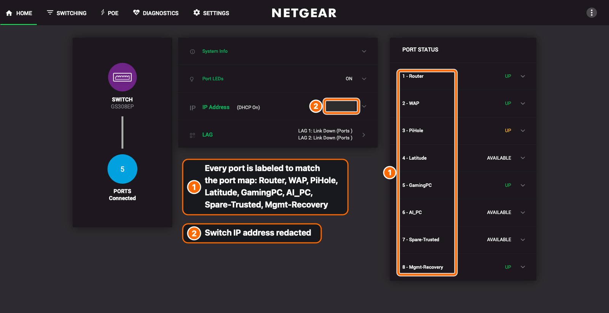

_The switch home page: every port labeled to match the port map. The switch IP is redacted._

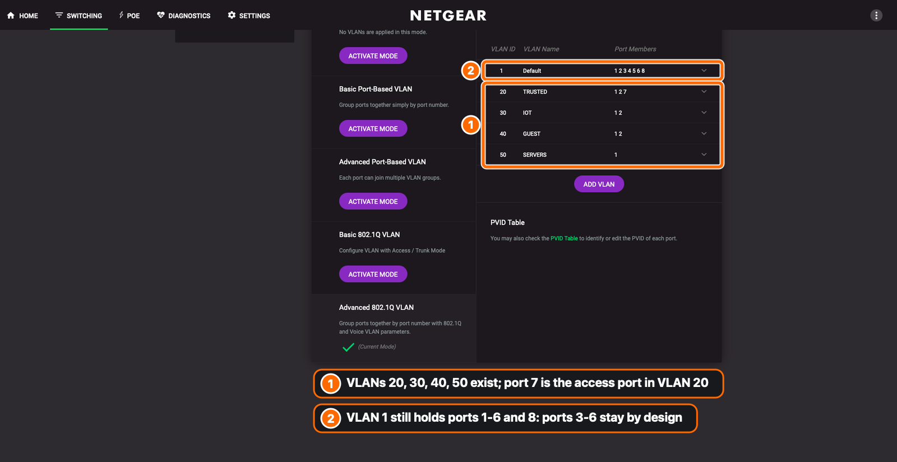

_Switching > VLAN at the end of this step: ports 3 to 6 are still in VLAN 1, by design._

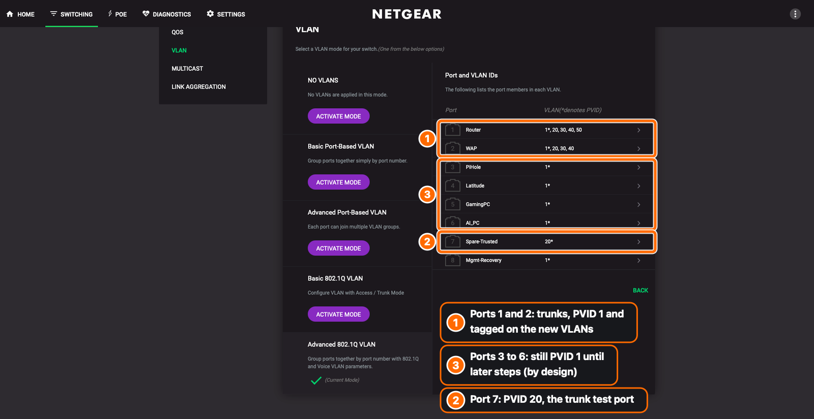

_Per-port VLANs (an asterisk marks the PVID)._

<a id="step-3"></a>

### 3. Access point: one SSID per VLAN (EAP610) — Date: 2026-10-09

_Decision: the original home network stays on Mgmt (untagged) for now. Remapping it to VLAN 20 before the step 5 rules would cut every wireless device off from the internet, so I created the Home, IoT and Guest SSIDs alongside it and retired the original in step 5._

| SSID | VLAN | Band | Security |
|---|---|---|---|
| Home (Trusted) | 20 | 2.4 + 5 GHz | WPA2/WPA3-Personal (transition mode), AES |
| IoT | 30 | 2.4 GHz only | WPA2-Personal (AES), because the Pico W and Pi Zero W support neither WPA3 nor 5 GHz |
| Guest | 40 | 5 GHz | WPA2/WPA3-Personal, with the AP's Guest Network option on (client isolation, no local subnets) |

- ✅ AP on static 10.0.1.3 (gateway 10.0.1.1, DNS 10.0.50.10). Its Management VLAN setting is off on purpose, so its admin traffic stays untagged on Mgmt and can't lock me out
- ✅ Home on VLAN 20 (both bands), IoT on VLAN 30, Guest on VLAN 40. A client on each SSID got a lease from the right pool

```
In standalone mode this AP configures each band separately, so a dual-band network is two entries with the
same name, password and VLAN. WPA2-PSK lets anyone who captures a handshake guess the password offline, as
fast as their hardware allows. WPA3-SAE prevents that and adds forward secrecy. Transition mode lets WPA3
devices get that protection while WPA2-only devices still join, but a WPA2 fallback still exists, so a
long random password still matters.
```

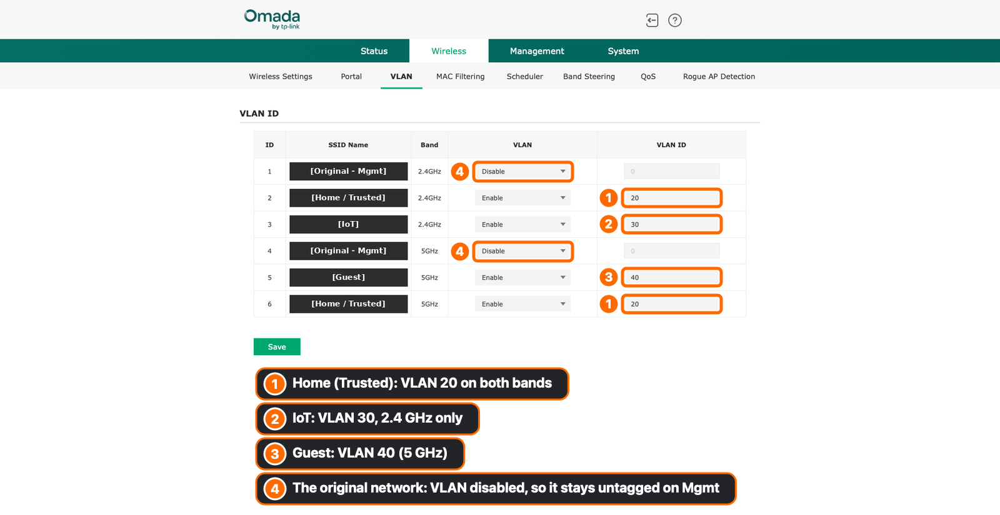

_Wireless > VLAN: the original home network has its VLAN setting disabled, so it stays untagged on Mgmt. SSID names are replaced with role labels._

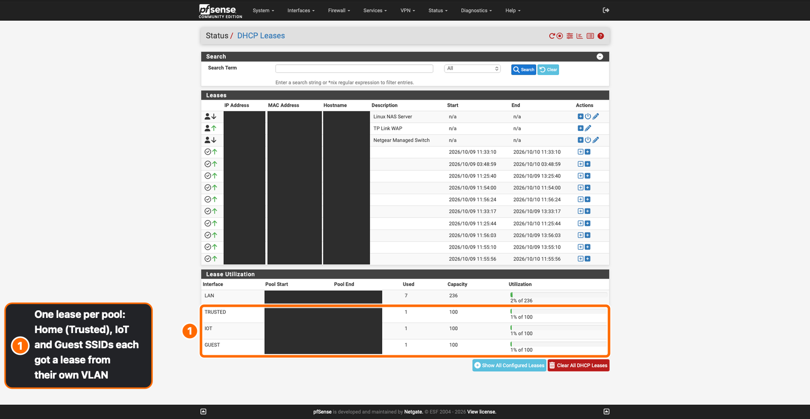

_Status > DHCP Leases: one lease in each of the TRUSTED, IOT and GUEST pools._

<a id="step-4"></a>

### 4. Pi-hole onto the Servers VLAN — Date: 2026-10-09

_Why: Pi-hole is the DNS server for every VLAN except Guest, so it belongs in the Servers VLAN, where pfSense decides who can reach it and what it can reach._

- ✅ Pi on switch port 3, untagged in VLAN 50 (PVID 50), excluded from VLAN 1. Static 10.0.50.10, set with NetworkManager (`nmcli`), and 127.0.0.1 as its own resolver (the port settings are in the step 5 screenshot)
- ✅ One pass rule on SERVERS: IPv4 TCP/UDP from the Pi-hole host to any destination on the `PIHOLE_OUT` ports (53, 80/443, 123). Everything else from SERVERS stays default-deny, and step 5 tightens it
- ✅ Listening mode changed from LOCAL to ALL (`sudo pihole-FTL --config dns.listeningMode ALL`). The Pi-hole v6 default only answers clients on its own subnet, so it ignored queries routed in from other VLANs. ALL is safe here because pfSense controls which VLANs can reach it
- ✅ Mgmt, Trusted, IoT and Servers hand out the Pi-hole as DNS. Guest keeps its own pfSense gateway
- ✅ Pi-hole local DNS records (`dns.hosts`) under `home.arpa`, the name RFC 8375 reserves for home networks: `pihole`, `pfsense`, `switch` and `ap`. The admin pages are now reached by name
- **Deferred:** reissuing `pihole-gui` with the Servers IP in its SAN (optional; the name works)

**Verification** (from a Mgmt client, because Trusted, IoT and Guest had no pass rules yet; their DNS was verified in step 5)

- A ping to the Pi-hole returned TTL 63, one hop below the Pi's default of 64. That shows the traffic is routed through pfSense between VLANs, not bridged.
- `dig @10.0.50.10 <name>` resolved names correctly, and `https://pihole.home.arpa/admin` loads with no certificate warning.

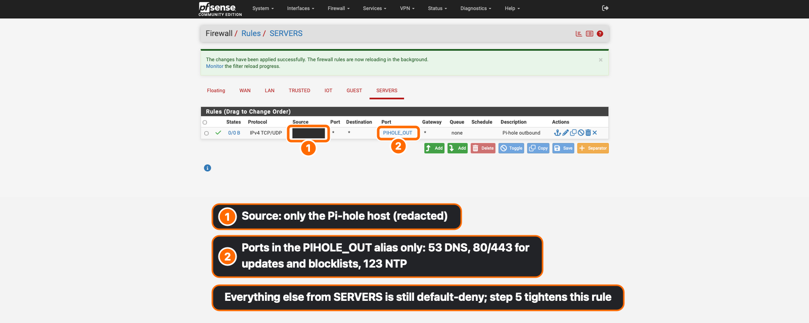

_Firewall > Rules > SERVERS: the single pass rule for the Pi-hole host. The source host is redacted._

<a id="step-5"></a>

### 5. Firewall rules and moving devices onto their VLANs — Date: 2026-10-09

_Why: until this step the new VLANs had no rules, so pfSense blocked all their traffic. Now each VLAN gets only what it needs. The rules are built from four aliases (`PRIVATE_NETS`, `PIHOLE`, `DNS_PORTS`, `PIHOLE_OUT`) so they read clearly and change in one place. The full rule table is in the [README](../README.md#firewall-rules); each VLAN follows the same pattern: allow what it needs, block the firewall, block internal networks, then allow the internet._

- ✅ Rules on TRUSTED, IOT, GUEST and SERVERS, and the Mgmt (LAN) allow rule kept. Trusted and IoT must use Pi-hole for DNS, and DNS to anywhere else (53 and 853) is blocked, which stops hardcoded resolvers and DNS-over-TLS. Guest uses its own gateway and never touches an internal server. This replaces my earlier plan of TRUSTED allow any and the NAT redirect for DNS
- ✅ Switch ports 5 and 6 (gaming PC and workstation) moved to VLAN 20: untagged, excluded from VLAN 1, PVID 20. Both got Trusted leases
- ✅ Phones, the watch, personal laptops and the gaming handheld moved to the Home SSID. The handheld is the Moonlight client and shares a VLAN with the gaming PC, so discovery and Wake-on-LAN need no cross-VLAN rule. A TV running Moonlight would stay on IoT with one narrow exception. I tested the wake in step 7 (test 10) and fixed a pairing problem on the way ([Problem 13](#problem-13))
- ✅ Work laptops moved to the Guest SSID, because employer-managed devices are untrusted on a home network
- ✅ I verified out-of-band management on a wired Mgmt port (switch port 8), then deleted the two original flat-network SSIDs. Only Home, IoT and Guest remain

Pi-hole still answers every VLAN even though Servers can't start connections into other VLANs, because pfSense is stateful and replies to allowed queries come back.

**Verification**

- **Trusted and IoT:** a lookup against a public resolver timed out, normal lookups resolved through Pi-hole, the firewall GUI timed out, and the Pi-hole query log showed Trusted clients.
- **Guest:** websites loaded, and the firewall GUI timed out.
- **Servers:** from the Pi-hole host, `curl` to the firewall GUI timed out, and `pihole -g` still downloaded every blocklist over 443.

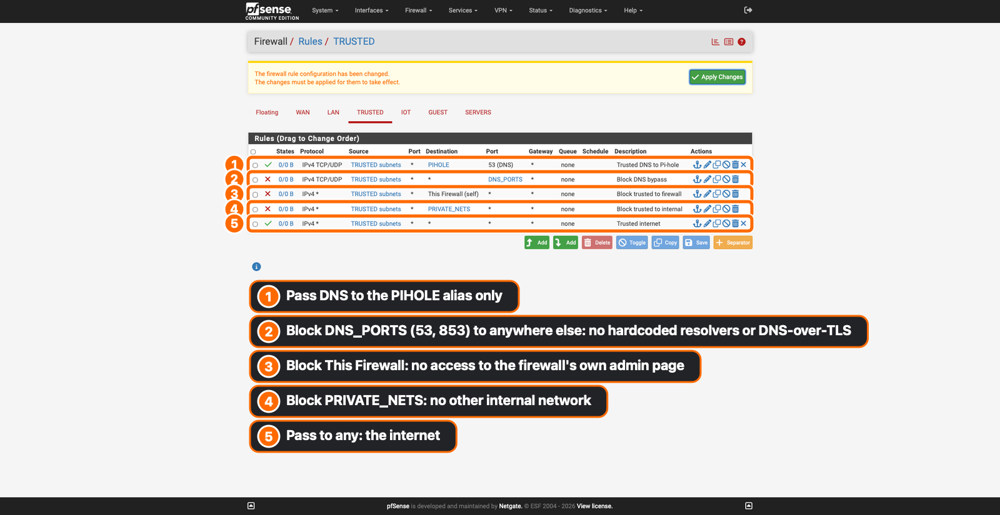

_Firewall > Rules > TRUSTED, in order. IoT uses the same five rules. This screenshot was taken just before I applied the changes._

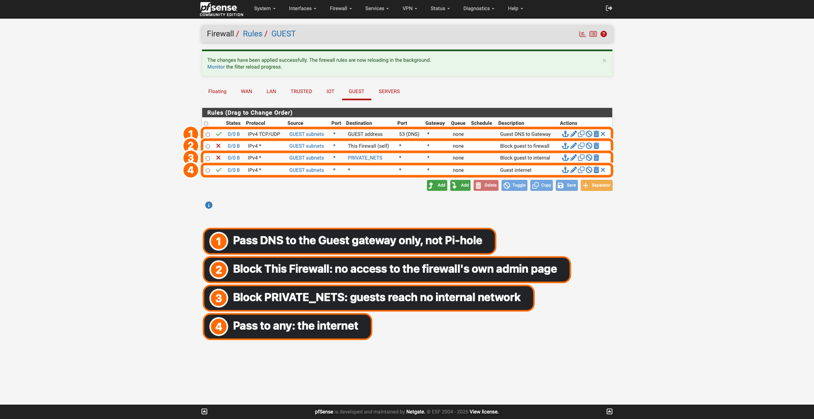

_GUEST: DNS to the Guest gateway only, then the blocks, then the internet._

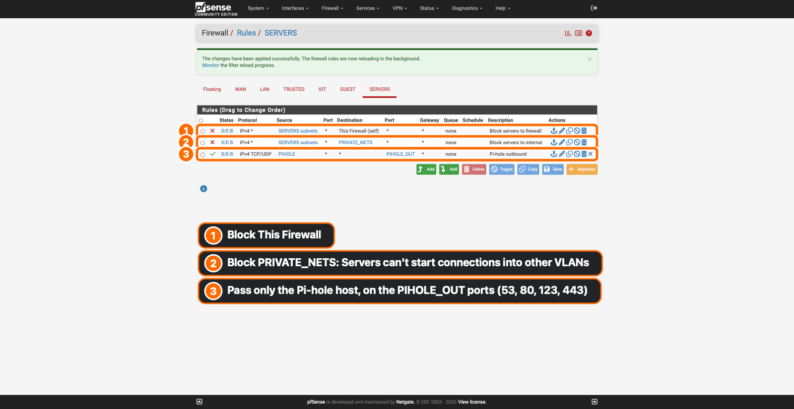

_SERVERS: the blocks sit above the Pi-hole pass rule, so they match first ([Problem 9](#problem-9))._

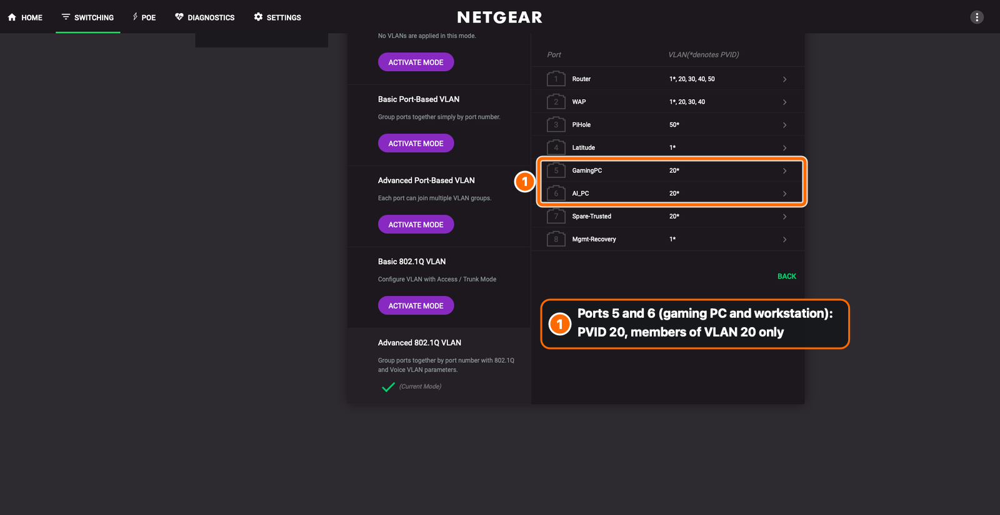

_Per-port VLANs at the end of step 5: port 3 (Pi-hole) is PVID 50, ports 5 and 6 (gaming PC, workstation) and spare port 7 are PVID 20, and port 4 (Latitude 7490) stays PVID 1 until it moves._

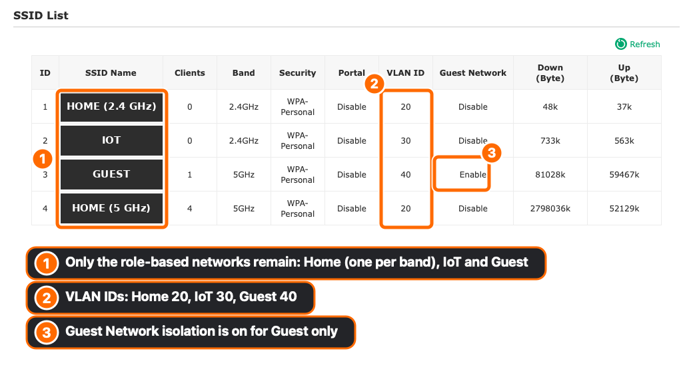

_The AP's SSID list after retiring the originals. Network names are replaced with role labels._

<a id="step-6"></a>

### 6. Move the hydroponics gear to IoT — Deferred until hardware is in place

The hydroponics project isn't built yet, so there are no devices to move. The IoT VLAN (30) is ready and was tested from a test client in steps 3 and 5: it hands out leases from its own pool, forces DNS through Pi-hole, blocks direct DNS to public resolvers, has no access to the firewall or any internal network, and allows the internet.

When the gear arrives: join each device to the IoT SSID (2.4 GHz), add a DHCP reservation, check that it reaches the internet but not Trusted, Servers or the firewall, and check the Pi-hole query log for unexpected domains. If a controller must be reached from Trusted, add one narrow rule from Trusted to that device and port, above the `PRIVATE_NETS` block, and don't open IoT to Trusted in general.

<a id="step-7"></a>

### 7. Validation matrix — Date: 2026-10-09

I ran every test from the restricted side on 2026-10-09, and all 10 passed.

| # | From | What I checked | Result | Pass |
|---|---|---|---|:-:|
| 1 | Mgmt (wired, switch port 8) | Ping to the gaming PC on Trusted, and the internet | The ping worked with TTL 63, so it was routed through pfSense. The internet worked | PASS (2026-10-09) |
| 2 | Trusted | A known ad domain | It resolved to 0.0.0.0, so Pi-hole is filtering | PASS (2026-10-09) |
| 3 | Trusted | A DNS query sent straight to 8.8.8.8 | It timed out, so DNS bypass is blocked | PASS (2026-10-09) |
| 4 | Trusted | The internet, and the pfSense and Pi-hole admin pages | The internet worked, and both admin pages timed out | PASS (2026-10-09) |
| 5 | IoT | The checks from tests 2 to 4 | The same results as tests 2 to 4 | PASS (2026-10-09) |
| 6 | IoT | The gaming PC and the switch | Both were unreachable | PASS (2026-10-09) |
| 7 | Guest | DNS, Pi-hole and the internet | DNS answered from the Guest gateway, Pi-hole was unreachable, and the internet worked | PASS (2026-10-09) |
| 8 | Guest | The PC, pfSense and the Pi-hole admin page | All three were unreachable | PASS (2026-10-09) |
| 9 | Servers (from the Pi-hole) | HTTPS and DNS out, ICMP out, and the PC and the switch | HTTPS and DNS out worked. ICMP out was blocked by design, because the pass rule is TCP/UDP only. The PC and the switch were unreachable | PASS (2026-10-09) |
| 10 | The handheld on the Home SSID | Moonlight Wake-on-LAN, then a stream from the gaming PC | The PC woke and the stream started. This passed after the fix in [Problem 13](#problem-13) | PASS (2026-10-09) |

_The Trusted-to-NextCloud and IoT-to-NextCloud tests wait for the Latitude 7490 to move to Servers. I did not record a separate "each VLAN hands out its own address" test; the leases from steps 2 and 3 are the evidence for that._

## Result

- Outcome: five VLANs with least-privilege rules on every zone, Pi-hole-enforced DNS, and admin restricted to wired Mgmt.
- Validation matrix: 10 of 10 passed on 2026-10-09 (step 7).
- What I would do differently: list every client that caches an address (DHCP leases, Moonlight pairings, certificate SANs) before re-addressing anything, and audit existing SSIDs for default-VLAN surprises first.
- Lesson learned: first-match rule order, and testing from the restricted side, catch mistakes that look right in the GUI.

---

## Problems I hit

<a id="problem-1"></a>

### Problem 1: No DHCP leases on the tagged interfaces (July 2026 attempt)

**Problem** — In my first attempt I configured five VLANs on pfSense and the switch, but pfSense showed no DHCP leases from the tagged interfaces. I also lost access to some devices and had to factory-reset them.

**Cause** — Not confirmed. My notes from that attempt don't record one.

**Fix** — I rebuilt in stages instead: backups and a wired recovery port first, then pfSense, the switch and the AP, with firewall rules last. The rebuild's trunk test passes ([step 2](#step-2-trunk-test)).

<a id="problem-2"></a>

### Problem 2: CA import failed with Keychain error -25294

**Problem** — Trusting the exported CA certificate on my Mac failed with Keychain error -25294.

**Cause** — Double-clicking the `.crt` tried to import it into the iCloud keychain, which can't hold certificates.

**Fix** — I imported it into the System keychain explicitly:

```
sudo security add-trusted-cert -d -r trustRoot -k /Library/Keychains/System.keychain homelab-ca.crt
```

**Lesson** — Install trust roots into the System keychain explicitly.

<a id="problem-3"></a>

### Problem 3: "Not Secure" persisted after the CA was trusted

**Problem** — The pfSense GUI still said "Not Secure" after I trusted the CA.

**Cause** — Admin Access was still serving "GUI default". I had created `pfsense-gui` but never selected it, and the page had only stopped warning because Safari remembered an earlier click-through.

**Fix** — I selected `pfsense-gui` under System > Advanced > Admin Access and saved.

**Lesson** — Creating a certificate doesn't deploy it, so check the issuer the browser actually sees.

<a id="problem-4"></a>

### Problem 4: Pi-hole PEM was missing its private key

**Problem** — The first combined PEM for Pi-hole held only the certificate: `grep BEGIN` showed one block instead of two.

**Cause** — I hadn't downloaded the key export.

**Fix** — I exported the key, rebuilt the PEM, and confirmed both the `BEGIN CERTIFICATE` and `BEGIN PRIVATE KEY` lines before copying it to the Pi.

**Lesson** — Verify the PEM contents before deploying it.

<a id="problem-5"></a>

### Problem 5: Access point serves a vendor default certificate

**Problem** — The EAP610 has no option to upload a custom certificate in standalone mode, even after updating its firmware from 1.5.0 to 1.8.0.

**Cause** — It serves a vendor default: a generic SAN (`omadaeap.net`, no IP) and fixed dates, 1 Jan 2019 to 2039. macOS rejects it mainly because the SAN doesn't match the address I browse to. The 20-year lifetime is a hygiene red flag, not the cause, because the 825-day limit only applies to certificates issued after 1 July 2019. It is likely shared across devices, and its key likely ships in public firmware. I haven't verified that.

**Fix** — I decided not to trust it, since trusting it would mean trusting any device that presents the same certificate, and I accept the warning for this one device. I added compensating controls: HTTPS only, TLS 1.0/1.1 and weak ciphers off, Layer-3 accessibility off, a 15-minute timeout, and (in step 5) admin only from wired Mgmt. Residual risk: if the key is as widely available as I suspect, someone already on Mgmt could impersonate the page. Wi-Fi traffic isn't affected, because WPA2/WPA3 protects it independently. Running the free Omada Software Controller with a `homelab-ca` certificate is an optional future fix; moving to Ubiquiti isn't worth it for this reason alone, because UniFi controllers also ship a self-signed certificate.

**Lesson** — When you can't fix a control, document the risk, decline the unsafe workaround, and add compensating controls.

<a id="problem-6"></a>

### Problem 6: Test laptop kept its old lease after moving VLANs

**Problem** — After I moved the laptop from port 8 (Mgmt) to port 7 (VLAN 20) with Wi-Fi off, it kept its old Mgmt lease.

**Cause** — macOS asks for its previous address when it reconnects, and Kea ignores that request instead of refusing it, so nothing told the laptop to start over.

**Fix** — I forced a renew on the wired interface and got 10.0.20.100 from the Trusted scope:

```
sudo ipconfig set <wired-interface> DHCP
```

**Lesson** — When a device changes VLANs, force a DHCP renew and test on the wired interface with Wi-Fi off, or a stale lease or Wi-Fi can fake a pass or a fail.

<a id="problem-7"></a>

### Problem 7: Guest Wi-Fi was bridged onto the management network

**Problem** — During the AP audit I found the existing guest SSID had VLAN ID 0 (untagged), so guest clients landed on Mgmt next to the admin pages of the firewall, switch, AP and DNS server.

**Cause** — A VLAN setting of 0 or "disabled" silently means "the management network".

**Fix** — I mapped the guest SSID to VLAN 40 and turned on the AP's Guest Network isolation. Guests had no internet until the Guest rules existed in step 5.

**Lesson** — Audit existing SSIDs before adding new ones.

<a id="problem-8"></a>

### Problem 8: Pi-hole admin login failed with "Server unreachable" after the move

**Problem** — After the move to the Servers VLAN, logging in at `https://<pihole IP>` failed with "Server unreachable".

**Cause** — Two things. Pi-hole's `webserver.domain` was `pihole.home.arpa`, but no DNS record existed for that name. And the certificate's IP SAN still listed the old address.

**Fix** — I added the local DNS records and used the hostname. `https://pihole.home.arpa/admin` now loads with no warning.

**Lesson** — When you move a server that has a TLS certificate, check its SANs and name records along with the IP.

<a id="problem-9"></a>

### Problem 9: Servers block rules were below the Pi-hole pass rule

**Problem** — I added the Servers block rules (This Firewall and `PRIVATE_NETS`) underneath the Pi-hole pass rule.

**Cause** — The first match wins, and the pass rule allows any destination on the `PIHOLE_OUT` ports, so it would have matched first and the blocks never would have.

**Fix** — Before applying, I moved both blocks above the pass rule. From the Pi-hole host, `curl` to the firewall GUI then timed out and `pihole -g` still worked.

**Lesson** — Blocks go above broad passes.

<a id="problem-10"></a>

### Problem 10: A port alias in the destination address box failed validation

**Problem** — pfSense refused the `DNS_PORTS` alias in the destination address box ("not a valid destination IP address or alias").

**Cause** — `DNS_PORTS` is a port alias, and port aliases belong in the port field.

**Fix** — I moved it to the destination port field. Address aliases such as `PIHOLE` and `PRIVATE_NETS` go in Address or Alias.

**Lesson** — Match the alias type to the field.

<a id="problem-11"></a>

### Problem 11: pfSense blocked its own new hostname as a DNS rebind attack

**Problem** — Browsing to the firewall by its new `home.arpa` hostname returned "Potential DNS Rebind attack detected".

**Cause** — pfSense's rebind protection rejects hostnames it doesn't know.

**Fix** — I added the hostname under System > Advanced > Admin Access > Alternate Hostnames.

**Lesson** — When you give an admin page a local name, register it on the firewall too.

<a id="problem-12"></a>

### Problem 12: Wired Mgmt laptop had an address but no DNS

**Problem** — On the wired Mgmt port the laptop had an IP address but no DNS server, so every hostname failed.

**Cause** — It still held a lease from before the Mgmt DHCP DNS changed to Pi-hole.

**Fix** — I forced a renew and checked the options in the lease:

```
sudo ipconfig set <wired-interface> DHCP
ipconfig getpacket <wired-interface>
```

**Lesson** — Renew leases after changing DHCP options.

<a id="problem-13"></a>

### Problem 13: Moonlight couldn't wake or re-add the gaming PC after it moved to Trusted

**Problem** — After I moved the gaming PC to the Trusted VLAN it got a new address. Moonlight on my handheld couldn't wake it, and I couldn't add it back either.

**Cause** — Found by running `ethtool` on the PC, which showed `Wake-on: g`. The NIC was set up for magic packets, so the PC side was fine, and that pointed at Moonlight's saved entry and the old pairing. Moonlight still had the PC under its old address and old pairing, so the wake packet and the pairing were tied to a host that no longer existed, and Sunshine kept the old pairing, which blocked a clean re-add. I inferred this from the fix; I didn't prove it.

**Fix** — I deleted the PC in Moonlight, ran Troubleshooting → Unpair All in the Sunshine web UI, and restarted Sunshine as a user service (plain `systemctl` fails because it isn't a system service). Then I re-added the PC by IP and paired again, and Wake-on-LAN worked.

```
systemctl --user restart sunshine
```

**Lesson** — Re-addressing a host breaks client-side pairings and saved entries, so re-pair the clients as part of any VLAN move.

---

**Tags:** `networking` `vlan` `802.1q` `pfsense` `dhcp` `dns` `pihole` `firewall` `tls` `pki` `homelab`
